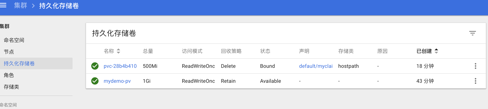
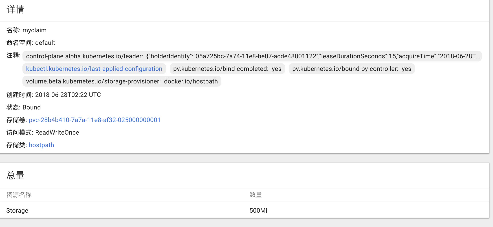
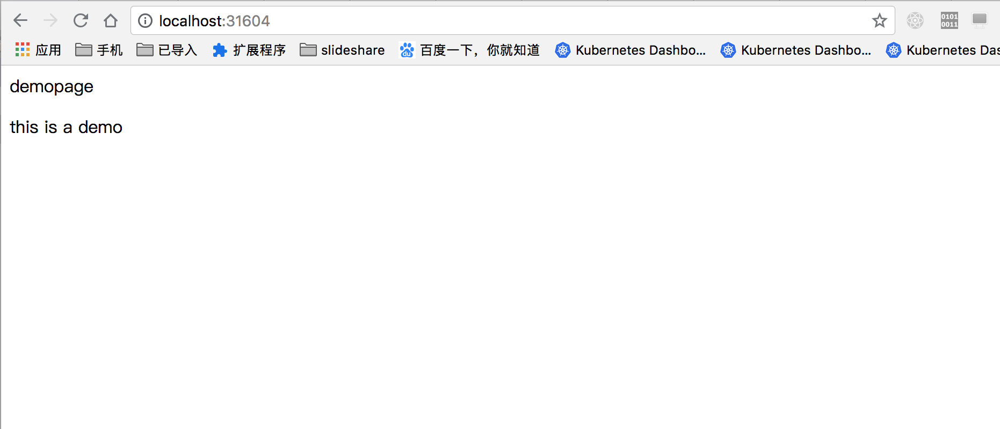

# pv && pvc demo

## How to Run

* create pv

```code
kubectl apply -f pv.yml
```

* create pvc

```code
kubectl apply -f pvc.yml
```

* use pvc

```code
kubectl apply -f app.yml
```

* copy some file

```code
kubectl cp $PWD/index.html podname:/usr/share/nginx/html/
```

* delete rc/pod

> the url is my dashboard url

```code
https://localhost:30001/api/v1/_raw/replicationcontroller/namespace/default/name/mynignx
you can still see the index.html page with the content
```

## stateful deploy

```code
kubectl apply -f stateful.yml
```

## some images



